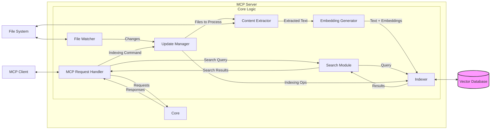

# MCP Server Architecture: Software Project Indexing & Semantic Search

## 1. Overview

This document outlines the architecture for a Model Context Protocol (MCP) server designed to index software project files and provide semantic search capabilities over the indexed content. The server will monitor project directories for changes and maintain an up-to-date index for efficient searching.

## 2. Goals

*   **Efficient Indexing:** Index various file types within a software project (source code, documentation, configuration files).
*   **Semantic Search:** Allow users to search the project content based on meaning rather than just keywords.
*   **Incremental Updates:** Automatically detect file changes (additions, modifications, deletions) and update the index accordingly without requiring a full re-index.
*   **MCP Compliance:** Expose indexing and search functionalities via MCP tools and resources.

## 3. Architecture Diagram (Conceptual)

## 4. Components

1.  **MCP Request Handler:** Manages MCP communication, routes requests.
2.  **File Watcher:** Monitors project directory for changes.
3.  **Update Manager:** Coordinates indexing based on file events or commands.
4.  **Content Extractor:** Reads files, extracts text, calculates hashes.
5.  **Embedding Generator:** Creates vector embeddings for text chunks.
6.  **Indexer:** Stores/manages metadata, text, and embeddings (using Vector DB).
7.  **Search Module:** Handles search queries, generates query embeddings, queries Indexer.
8.  **Vector Database:** Specialized DB for storing and searching vectors.

## 5. Data Flow

*   **Initial Indexing:** MCP command -> Update Manager -> Scan -> Extract -> Embed -> Index -> Store in Vector DB.
*   **Incremental Update:** File Watcher event -> Update Manager -> Extract -> Check Hash -> (If changed) Embed -> Update/Add in Vector DB; (If deleted) Remove from Vector DB.
*   **Semantic Search:** MCP command -> Search Module -> Embed Query -> Query Vector DB -> Format Results -> Return via MCP.

## 6. Data Models

*   **Indexed Document:** `document_id`, `file_path`, `content_hash`, `last_modified_timestamp`, `extracted_text_chunk`, `metadata`, `embedding_vector`.
*   **Vector DB Entry:** `embedding_vector`, `document_id` (reference).

## 7. Technology Suggestions

*   **Language:** Python (recommended) or Rust.
*   **File Watching:** `watchdog` (Python), `notify` (Rust).
*   **Content Extraction:** `tree-sitter`, standard libraries.
*   **Embedding Models:** Sentence Transformers (`all-MiniLM-L6-v2`, `multi-qa-mpnet-base-dot-v1`, `e5-large-v2`).
*   **Vector DB:** `ChromaDB` (simple), `Qdrant` (performant), `FAISS`, `Weaviate`.
*   **MCP Communication:** Custom implementation using standard libraries (stdio, HTTP/SSE).

## 8. MCP API Design

*   **Server Name:** `project-indexer`
*   **Tools:**
    *   `index_project(project_path, force_reindex=False)`: Starts/restarts indexing.
    *   `semantic_search(project_path, query, top_k=5)`: Performs search.
*   **Resources:**
    *   `mcp://project-indexer/status/{url_encoded_project_path}`: Gets indexing status.

## 9. Considerations

*   Scalability, chunking strategy, resource usage, error handling, configuration.