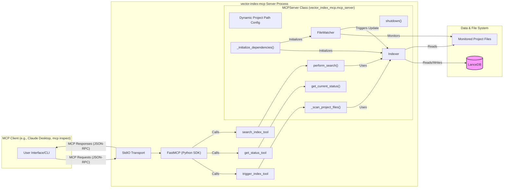

# MCP Server Architecture: Software Project Indexing & Semantic Search

## 1. Overview

This document outlines the architecture for a Model Context Protocol (MCP) server designed to index software project files and provide semantic search capabilities over the indexed content. The server will monitor project directories for changes and maintain an up-to-date index for efficient searching.

## 2. Goals

*   **Efficient Indexing:** Index various file types within a software project (source code, documentation, configuration files).
*   **Semantic Search:** Allow users to search the project content based on meaning rather than just keywords.
*   **Incremental Updates:** Automatically detect file changes (additions, modifications, deletions) and update the index accordingly without requiring a full re-index.
*   **MCP Compliance:** Expose indexing and search functionalities via MCP tools.

## 3. Architecture Diagram (Conceptual)

## 4. Components

1.  **`FastMCP` (Python SDK)**: Replaces "MCP Request Handler". Responsible for handling the MCP protocol (stdio), defining, and invoking tools. Located in [`vector_index_mcp/main_mcp.py`](vector_index_mcp/main_mcp.py).
2.  **`MCPServer` Class**: The core class encapsulating the server's business logic (initialization, scanning, searching, status management, file watcher, indexer). Located in [`vector_index_mcp/mcp_server.py`](vector_index_mcp/mcp_server.py).
3.  **File Watcher (`FileWatcher`)**: Monitors the specified project directory for file changes (creation, modification, deletion). Uses the `watchdog` library. Located in [`vector_index_mcp/file_watcher.py`](vector_index_mcp/file_watcher.py).
4.  **Content Extractor (`ContentExtractor`)**: Extracts textual content from various file types and splits it into chunks. Located in [`vector_index_mcp/content_extractor.py`](vector_index_mcp/content_extractor.py).
5.  **Embedding Generator (part of `Indexer`)**: Creates vector representations (embeddings) for text chunks using Sentence Transformers models. Logic is integrated within the `Indexer`.
6.  **Indexer (`Indexer`)**: Manages the storage, updating, and deletion of metadata, text chunks, and their vector representations in the vector database (LanceDB). Located in [`vector_index_mcp/indexer.py`](vector_index_mcp/indexer.py).
7.  **Vector Database**: `LanceDB` is used for storing and searching vector embeddings.

## 5. Data Flow

*   **Initial Indexing / Trigger Index**: MCP client calls the `trigger_index` tool -> `FastMCP` -> `trigger_index_tool` -> `MCPServer._scan_project_files()` -> `Indexer` (scans, extracts content via `ContentExtractor`, generates embeddings, saves to `LanceDB`).
*   **Incremental Update**: `FileWatcher` detects changes -> notifies `Indexer` -> `Indexer` processes changes (extracts, generates embeddings, updates/adds/deletes in `LanceDB`).
*   **Semantic Search**: MCP client calls the `search_index` tool -> `FastMCP` -> `search_index_tool` -> `MCPServer.perform_search()` -> `Indexer` (generates query embedding, searches in `LanceDB`) -> results are returned to the client.
*   **Get Status**: MCP client calls the `get_status` tool -> `FastMCP` -> `get_status_tool` -> `MCPServer.get_current_status()` -> status is returned to the client.

## 6. Data Models

*   **`IndexedDocument` (Schema for LanceDB table):**
    *   `document_id: str` - Unique identifier for this specific document chunk (e.g., 'file_path::chunk_index').
    *   `file_path: str` - Path to the original file, relative to the project root or absolute.
    *   `content_hash: str` - SHA256 hash of the original file's content at the time of indexing.
    *   `last_modified_timestamp: float` - Last modified timestamp (Unix epoch seconds) of the original file when it was indexed.
    *   `chunk_index: int` - Zero-based index of this chunk within the original file.
    *   `total_chunks: int` - Total number of chunks the original file was divided into.
    *   `extracted_text_chunk: str` - The actual text content of this specific chunk.
    *   `metadata: FileMetadata` - Contains `original_path`.
    *   `vector: Vector(384)` - Embedding vector for this text chunk (dimension depends on the model).
*   **`FileMetadata` (Nested in `IndexedDocument`):**
    *   `original_path: str` - The original, absolute or project-relative path of the indexed file.

## 7. Technology Stack

*   **Language**: Python 3.10+ (as per `requires-python >=3.8` in `pyproject.toml`, but 3.10+ is a good practice for modern features).
*   **MCP Communication**: Python MCP SDK (`FastMCP`) over stdio.
*   **File Watching**: `watchdog`.
*   **Content Extraction**: Standard Python libraries, `pathspec` (for `.gitignore` logic).
*   **Embedding Models**: Sentence Transformers (configurable, defaults to `all-MiniLM-L6-v2`).
*   **Vector DB**: `LanceDB`.
*   **Configuration**: `pydantic-settings` (for loading settings from environment variables / `.env` file).
*   **CLI Argument Parsing**: `sys.argv` (in [`main_mcp.py`](vector_index_mcp/main_mcp.py)).

## 8. MCP Interface

*   **Server Name**: `vector-index-mcp` (as specified in `FastMCP(name="vector-index-mcp", ...)`).
*   **Tools**:
    *   `trigger_index(force_reindex: bool = False)`: Triggers the indexing process for the project path specified at server startup.
    *   `get_status()`: Gets the current status of the indexer.
    *   `search_index(query: str, top_k: int = 5)`: Performs a semantic search over the indexed content.
*   **Resources**: "Currently, no MCP resources are exposed. Functionality is provided via tools."

## 9. Considerations

*   Scalability, chunking strategy, resource usage, error handling, configuration.
*   **Server Instance per Project:** The server is designed to index and monitor a single project path specified at startup. To index multiple projects concurrently, multiple instances of the server must be run, each configured with a different project path.
*   **Asynchronous Operations:** Core operations are implemented asynchronously to improve responsiveness, especially during I/O-bound tasks like file scanning and database interactions.