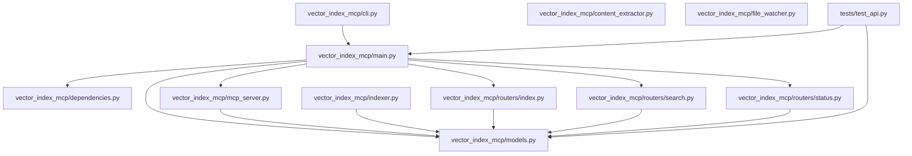

# MCP Server: Software Project Indexing & Semantic Search

This project provides a Model Context Protocol (MCP) server designed to index software project files and offer semantic search capabilities over the indexed content. It monitors project directories for changes and maintains an up-to-date index.

For detailed design and architectural decisions, please refer to [ARCHITECTURE.md](ARCHITECTURE.md).

## Usage (End Users)

This server is designed to be run easily within the directory of the software project you want to index.

### 1. Install `pipx` (One-time Setup)

`pipx` allows running Python applications in isolated environments. If you don't have it, install it:

```bash
pip install pipx
pipx ensurepath
# Restart your terminal after running ensurepath if the command isn't found
```

### 2. Configure the Server

Navigate to the root directory of the software project you wish to index. Create a `.env` file in this directory with the following content:

```dotenv
# --- Required ---
# Path to the software project you want to index (use '.' for the current directory)
PROJECT_PATH=.

# --- Optional (Defaults Provided) ---
# URI for the LanceDB database. './.lancedb' stores it within your project folder.
LANCEDB_URI=./.lancedb

# Name of the Sentence Transformer model to use for embeddings
EMBEDDING_MODEL_NAME=all-MiniLM-L6-v2

# Comma-separated list of glob patterns to ignore (relative to PROJECT_PATH)
# Example: IGNORE_PATTERNS=*.log,*.tmp,node_modules/*,.git/*,dist/*
IGNORE_PATTERNS=__pycache__/*,.git/*,*.db,*.pyc,build/*,dist/*

# Host and Port for the server (rarely need changing for local use)
HOST=0.0.0.0
PORT=8000
```

**Explanation:**

*   `PROJECT_PATH`: **Required.** Set this to `.` to index the current directory where you run the server.
*   `LANCEDB_URI`: Path where the LanceDB vector database will be stored. Using `./.lancedb` keeps the index data within your project directory. Defaults to `./.lancedb`.
*   `EMBEDDING_MODEL_NAME`: The Hugging Face Sentence Transformer model used for generating embeddings. Defaults to `all-MiniLM-L6-v2`.
*   `IGNORE_PATTERNS`: Comma-separated list of glob patterns specifying files/directories to exclude from indexing, relative to `PROJECT_PATH`. Defaults are provided.
*   `HOST`: Host address for the server. Defaults to `0.0.0.0`.
*   `PORT`: Port for the server. Defaults to `8000`.

### 3. Run the Server

From the root directory of your software project (where the `.env` file is located), run:

```bash
pipx run vector-index-mcp
```

`pipx` will automatically download the server, install its dependencies in an isolated environment, and start it. The server will use the `.env` file in your current directory for configuration, begin watching the `PROJECT_PATH` for changes, and create the LanceDB database at `LANCEDB_URI`.

You may need to trigger an initial scan via the API if the index is empty (see API Endpoints).

## Development Setup

If you want to contribute to or modify the server itself:

1.  **Clone the repository:**
    ```bash
    git clone <your-repository-url> # TODO: Update URL
    cd vector-index-mcp
    ```
2.  **Set up the development environment:**
    This command creates a virtual environment (`.venv`), installs all required dependencies (runtime and development), including `ruff` for linting/formatting.
    ```bash
    make install-dev
    ```
3.  **Activate the virtual environment:**
    ```bash
    source .venv/bin/activate
    ```
    (On Windows using Git Bash or WSL, the command is the same. For Command Prompt/PowerShell, use `.venv\Scripts\activate`)

4.  **(Optional) Create a `.env` file in the `vector-index-mcp` project root** for development-specific settings if needed (e.g., for `make run-dev`).

## Development Commands

Ensure your virtual environment is activated (`source .venv/bin/activate`) before running these `make` commands from the `vector-index-mcp` project root:

*   `make test`: Run the test suite using `pytest`.
*   `make lint`: Check code style and format using `ruff`.
*   `make run-dev`: Start the development server with auto-reload. Uses the `.env` file in the `vector-index-mcp` root if present.
*   `make clean`: Remove temporary files (`__pycache__`, build artifacts, etc.).
*   `make help`: Display a list of available commands.

## API Endpoints

The server exposes the following HTTP endpoints:

### 1. Root

*   **Method:** `GET`
*   **Path:** `/`
*   **Description:** Simple health check endpoint.
*   **Example Response (200 OK):**
    ```json
    {
      "message": "MCP Indexing Server is running."
    }
    ```

### 2. Index Project

*   **Method:** `POST`
*   **Path:** `/index`
*   **Description:** Triggers a full re-indexing of the configured `PROJECT_PATH`. Use `force_reindex: true` to clear the existing index first.
*   **Example Request Body:**
    ```json
    {
      "project_path": ".", // Must match PROJECT_PATH from .env
      "force_reindex": false
    }
    ```
*   **Example Response (202 Accepted):**
    ```json
    {
      "message": "Indexing process initiated for . in the background."
    }
    ```
*   **Example Response (409 Conflict):**
    ```json
    {
        "detail": "An indexing scan is already in progress."
    }
    ```

### 3. Semantic Search

*   **Method:** `POST`
*   **Path:** `/search`
*   **Description:** Performs a semantic search over the indexed content for the configured `PROJECT_PATH`.
*   **Example Request Body:**
    ```json
    {
      "query": "How is user authentication handled?",
      "top_k": 5 // Optional, defaults to 5
    }
    ```
*   **Example Response (200 OK):**
    ```json
    {
        "results": [
            {
                "document_id": "path/to/file.py::0",
                "file_path": "path/to/file.py",
                "content_hash": "...",
                "last_modified_timestamp": 1678886400.0,
                "extracted_text_chunk": "... relevant text chunk ...",
                "metadata": {
                    "original_path": "path/to/file.py"
                }
            }
            // ... more results
        ]
    }
    ```
*   **Example Response (503 Service Unavailable):**
    ```json
    {
        "detail": "Search unavailable: Index not yet built or server initializing."
    }
    ```

### 4. Get Indexing Status

*   **Method:** `GET`
*   **Path:** `/status/{project_path:path}`
*   **Description:** Retrieves the current indexing status for the specified project path (must match the configured `PROJECT_PATH`). The project path must be URL-encoded if it contains special characters (e.g., `.` becomes `%2E`).
*   **Example Request:** `GET /status/%2E` (for `PROJECT_PATH=.`)
*   **Example Response (200 OK):**
    ```json
    {
      "project_path": ".",
      "status": "Watching", // or "Scanning", "Error", "Idle - Initial Scan Required"
      "last_scan_start_time": 1678886400.0,
      "last_scan_end_time": 1678886460.0,
      "indexed_chunk_count": 150,
      "error_message": null
    }
    ```
*   **Example Response (404 Not Found):**
    ```json
    {
        "project_path": "/some/other/path",
        "status": "Not Found",
        "last_scan_start_time": null,
        "last_scan_end_time": null,
        "indexed_chunk_count": null,
        "error_message": "Status requested for a path not managed by this server instance."
    }


### 5. Project structure

